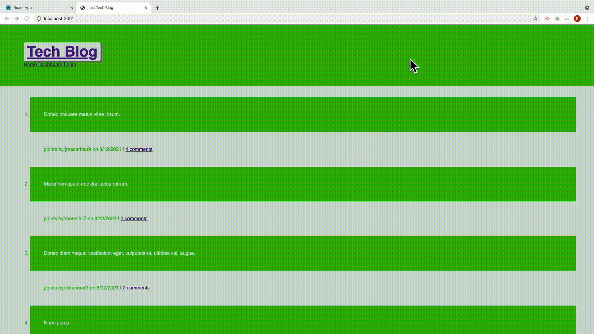
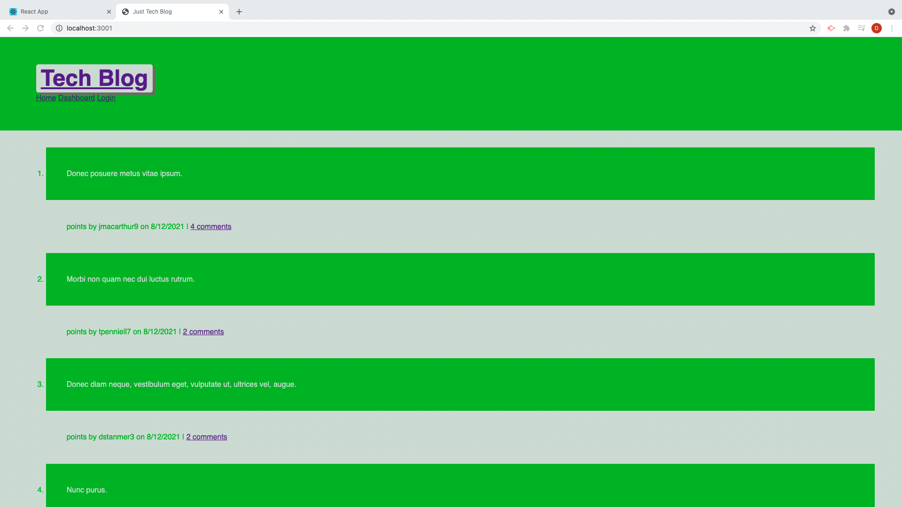

[]()
<br />

  <h1 align="center"> Just Tech Blog </h1>



<h4 align='center'>A blog for Techs </h4>

## Table of Contents

- [Description](#description)
- [Installation](#installation)
- [Purpose](#purpose)
- [License](#license)
- [Contributing](#contributing)
- [Issues](#issues)
- [Tests](#tests)
- [Links](#links)

## Description

This is a program that allows someone to create, track and edit a team's makeup from a command line program run in Node.js, using Express.js, MySQL2, Sequelize and Handlebars. There are a few other dependecies added to enhance the functionality.

## Installation

To use this app you must install [Node.js](https://nodejs.org/en/). Once you have Node.js installed, then install Node Package Manager(npm).

first...

```
npm init -y
```

then...

```
npm install express express-handlebars mysql2 sequelize dotenv bcrypt express-sessions connect-sessions-sequelize
```

## Purpose

To create a way for techs to voice their views on a blog that is focused on them.

## License


<br />
This application is not covered by any license.

## Contributing

With support and assistance from the developer community at large.

## Issues

There may be slight challenges with all functionality as of initial deployment

## Testing

No testing was done

## Links



[Just Tech Blog](https://afternoon-anchorage-01216.herokuapp.com/)
